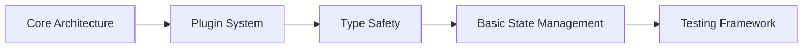

# Implementation Strategy & Priority Matrix

## 🎯 MVP to Market Leader: Phased Approach

### Phase 0: Foundation (Months 1-2)
**Goal**: Solid technical foundation



**Critical Decisions**:
- **Tech Stack**: React + TypeScript + Zustand + Tailwind
- **Architecture**: Plugin-based with clear boundaries
- **Data Model**: Extensible schema with versioning
- **Testing**: Jest + React Testing Library + Playwright

### Phase 1: Core Product (Months 3-4)
**Goal**: Better than basic PowerPoint for developers

| Feature | Priority | Complexity | Impact |
|---------|----------|------------|---------|
| Code blocks with syntax highlighting | 🔴 High | Medium | High |
| Markdown support | 🔴 High | Low | High |
| Version control integration | 🔴 High | Medium | High |
| Keyboard shortcuts | 🔴 High | Low | High |
| PDF export | 🔴 High | Medium | High |
| Dark mode | 🟡 Medium | Low | Medium |
| Basic templates | 🟡 Medium | Low | Medium |

### Phase 2: Differentiation (Months 5-6)
**Goal**: Features competitors don't have

| Feature | Priority | Complexity | Impact |
|---------|----------|------------|---------|
| Live code execution | 🔴 High | High | Very High |
| Git-style branching for slides | 🔴 High | High | Very High |
| API/webhook integration | 🔴 High | Medium | High |
| Real-time collaboration | 🟡 Medium | High | High |
| AI content suggestions | 🟡 Medium | Medium | High |
| Interactive diagrams | 🟡 Medium | Medium | Medium |

### Phase 3: Scale (Months 7-9)
**Goal**: Enterprise-ready platform

```typescript
// Key metrics to track
const successMetrics = {
  performance: {
    initialLoad: '<2s',
    slideTransition: '<100ms',
    collaboration: '<50ms latency'
  },
  scale: {
    concurrentUsers: 10000,
    presentationSize: '1000 slides',
    storagePerUser: '10GB'
  },
  reliability: {
    uptime: '99.9%',
    dataLoss: '0%',
    syncFailures: '<0.1%'
  }
};
```

### Phase 4: Market Leadership (Months 10-12)
**Goal**: Category-defining features

- **AI Co-presenter**: Present when you can't
- **AR Mode**: Holographic presentations
- **Blockchain Certs**: Verifiable completion
- **Global CDN**: <50ms anywhere
- **White-label**: Branded instances

## 📊 Resource Allocation Strategy

### Team Composition
```
┌─────────────────────────────────────┐
│  Frontend (40%)                     │
│  ├── UI/UX Lead                     │
│  ├── React Developers (2)           │
│  └── Design System Engineer         │
├─────────────────────────────────────┤
│  Backend (30%)                      │
│  ├── API Architect                  │
│  ├── Database Engineer              │
│  └── DevOps/SRE                    │
├─────────────────────────────────────┤
│  Specialized (30%)                  │
│  ├── AI/ML Engineer                 │
│  ├── Security Engineer              │
│  └── Performance Engineer           │
└─────────────────────────────────────┘
```

### Budget Priorities
1. **Infrastructure (35%)**: AWS/GCP, CDN, monitoring
2. **Development (40%)**: Salaries, tools, licenses
3. **AI/ML Services (15%)**: GPT-4, Cloud AI APIs
4. **Marketing/Growth (10%)**: Developer relations, content

## 🚀 Go-to-Market Strategy

### Developer-First Launch
```typescript
// Open source core with paid cloud
const businessModel = {
  openSource: {
    core: 'MIT License',
    communityPlugins: true,
    selfHosted: true
  },
  cloud: {
    free: { users: 5, storage: '1GB' },
    team: { price: '$10/user/month' },
    enterprise: { custom: true }
  },
  marketplace: {
    plugins: '70/30 revenue split',
    templates: '80/20 revenue split',
    themes: '80/20 revenue split'
  }
};
```

### Growth Tactics
1. **Technical Content**: Blog posts, tutorials, videos
2. **Developer Tools**: VS Code extension, CLI tool
3. **Community**: Discord, GitHub discussions, showcases
4. **Partnerships**: Integration with GitHub, GitLab, Jira
5. **Education**: Free for students and educators

## 🎨 Technical Debt Management

### Refactoring Schedule
```typescript
// Automated debt tracking
const technicalDebtTracker = {
  metrics: {
    codeComplexity: 'cyclomatic < 10',
    testCoverage: '> 80%',
    bundleSize: '< 500KB',
    dependencies: 'audit weekly'
  },
  
  refactoringTriggers: {
    performance: 'p95 > 200ms',
    bugs: 'critical > 2/month',
    velocity: 'decrease > 20%'
  },
  
  allocation: '20% sprint capacity'
};
```

## 🔐 Risk Mitigation

### Technical Risks
| Risk | Impact | Mitigation |
|------|---------|------------|
| Scaling issues | High | Load testing from day 1 |
| Security breach | Critical | Security-first design |
| Data loss | Critical | Multi-region backups |
| Tech obsolescence | Medium | Modular architecture |

### Business Risks
| Risk | Impact | Mitigation |
|------|---------|------------|
| Competitor copy | Medium | Patent key innovations |
| Platform dependence | High | Multi-cloud strategy |
| Key person loss | High | Documentation culture |
| Funding gaps | High | Revenue from month 6 |

## 📈 Success Metrics

### Year 1 Targets
- **Users**: 10,000 MAU
- **Revenue**: $500K ARR  
- **NPS**: > 50
- **Retention**: > 80%
- **Performance**: < 100ms p95

### Year 2 Vision
- **Users**: 100,000 MAU
- **Revenue**: $5M ARR
- **Enterprise**: 50 customers
- **Platform**: 500+ plugins
- **Global**: 10 languages

## 🎯 Quick Wins (Do First!)

1. **Week 1**: Set up CI/CD pipeline
2. **Week 2**: Create design system
3. **Week 3**: Build plugin architecture  
4. **Week 4**: Launch alpha with 10 users
5. **Month 2**: Open source announcement
6. **Month 3**: First paying customer

## 💡 Innovation Opportunities

### Unique Differentiators
- **Code-first**: Write presentations in code
- **Git-native**: Branch, merge, PR reviews
- **AI pair programmer**: For presentations
- **Live data**: Real-time dashboard slides
- **Multiplayer**: Google Docs for slides

### Patent Opportunities
- Predictive slide preloading algorithm
- AI presentation coach
- Gesture-based navigation system
- Collaborative cursor algorithms
- Smart layout engine

Remember: **Start small, iterate fast, listen to users**. The best features will emerge from real usage, not planning documents.